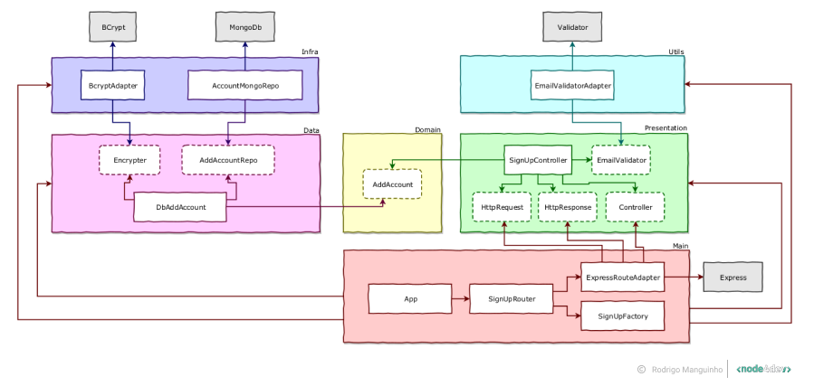

<h1 align="center">
    
</h1>

This course will demonstrate in practice how to create an API in NodeJs using Typescript, MongoDB and following the best methodologies on the market. This content is focused on advanced and relevant content such as: Design Patterns, Clean Architecture, SOLID, DDD and TDD. The main objective of this training is to make the student leave his comfort zone and see that there are many things to be studied to become a technical leader or a software architect.

The project is to create a complete API with Login, Registration, Poll Creation, Poll List, Respond to a Poll and Poll Result.

In addition to all this, it is shown in practice how to use Git, Docker, Jest, CI/CD, Swagger in the correct way and how to keep our code always clean, organized and well structured, even creating locks to prevent faulty or bad code from happening. formatted files are committed to our repository. Also talking about the correct use of middleware for managing permissions on routes and security in generating passwords.

## Architecture

<h1 align="center">
    
</h1>
